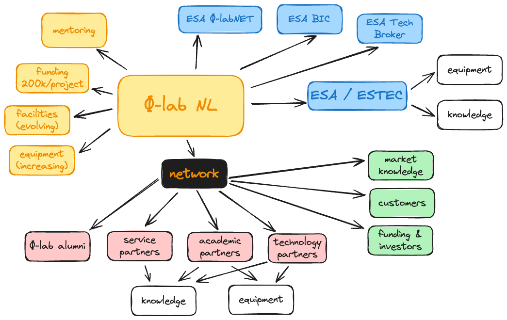

# NL Phi-Lab

## **About**

### **Innovation through Space**

At NL Phi-Lab, we nurture pioneering research into transformative technologies with strong commercial potential. As part of the [European Space Agency](https://www.esa.int/)’s [Phi-LabNET](https://commercialisation.esa.int/phi-labnet/), we forge the connections needed to propel the future of space innovation and enhance Europe’s global competitiveness.

### **Innovation through Collaboration**

We believe that collaboration between research institutions and the market sector can yield radical innovations and new, sustainable business. This drives us to help transform research into groundbreaking solutions. [Phi-LabNET](https://commercialisation.esa.int/phi-labnet/) will also facilitate partnerships and funding from [ESA](https://www.esa.int/) and private investors.

### **Themes**

We focus on Earth Observation, Position, Navigation and Timing, and Laser Satellite Communication, but we will support any demonstrably good project or idea.

### **Where You Come In**

[Apply](https://www.notion.so/33678e702f6940f1ad5cd4ae19eefa2b?pvs=21) to participate in collaborative research projects and develop innovative solutions. You will be supported along the way and have the chance to develop new [partnerships](https://www.notion.so/33678e702f6940f1ad5cd4ae19eefa2b?pvs=21) in the space sector.

### **Comprehensive Support and Resources**

[**Funding**](#funding)   Benefit from an innovation incentive of €200k per project.

[**Support & Coaching**](#support--coaching)  Get extensive guidance in science, technology, business, IP, and sustainability.

[**Workspace**](#workspace)  Enjoy free workspace at [NL Space Campus](https://www.nlspacecampus.eu/) in Noordwijk, right next to ESA [ESTEC](https://www.esa.int/About_Us/ESTEC).

[**Facilities**](#facilities) Access modern labs, makerspaces, and other specialised facilities.

[**Partner Network**](#partner-network)  Leverage our expansive network to build valuable connections with our partners.

## NL Phi-Lab Structure

## **Application Steps**

**1. Explore**

Explore our [Call for Projects](https://www.notion.so/spaceatipn/call-for-projects.html) info, try our [Eligibility Checklist](https://www.notion.so/spaceatipn/eligibility-checklist.html), attend an Info Session, and submit an [Idea Outline](https://www.notion.so/spaceatipn/idea-outline.html).

**2. Prepare**

Prepare your Project Proposal. We offer contact hours for advice, connections to relevant partners, and feedback.

**3. Submit**

Submit your Project Proposal. Prepare for the evaluation, which will include an interview. Await to be contacted with the result.

## **Support and Resources**

### **Funding**

Each project is eligible to receive innovation incentive funding up to €200k. The funds are distributed in phases: approximately 35% at the start, 35% upon achieving progress milestones, and 30% after the final deliverables are accepted. This structured funding helps ensure that research teams have the necessary resources throughout the project lifecycle. Additionally, any equipment purchased with the incentive funding may be requested to be returned to NL Phi-Lab as part of the final deliverables. This approach ensures efficient use of resources and supports the ongoing research efforts within NL Phi-Lab.

### **Support & Coaching**

Research teams benefit from a supportive environment that includes office space, interaction with peers, and access to a network of business and technical [partners](https://www.notion.so/33678e702f6940f1ad5cd4ae19eefa2b?pvs=21). NL Phi-Lab organizes masterclasses, seminars, and equipment demos to address real challenges and stimulate innovation. Teams are also given opportunities to present their work at national and international events, fostering connections with potential collaborators, customers, and investors. The program includes continuous mentoring, training, and technical support, ensuring that research teams have the necessary resources to succeed.

### **Workspace**

Research teams have free access to a fully equipped workspace at the SBIC Noordwijk building, located on the NL Space Campus near ESA/ESTEC. The workspace includes dedicated units with desks, chairs, and storage, as well as access to meeting rooms and regular networking events. The dynamic environment encourages collaboration, knowledge sharing, and interaction with industry experts in residence. This setup provides an ideal atmosphere for research teams to focus on their projects, make valuable connections, and enhance their productivity within a supportive and professional infrastructure.

### **Facilities**

Research teams have access to state-of-the-art facilities, including modern labs, makerspaces, and specialised equipment. These resources are essential for conducting high-level research and development activities. The facilities support various aspects of space-related research, from prototyping and testing to data analysis and experimentation. By providing access to these advanced resources, NL Phi-Lab ensures that research teams are well-equipped to innovate and push the boundaries of current technology. This access plays a crucial role in the successful execution of research projects and the development of cutting-edge solutions. Partner facility access will be granted via the NL Phi-Lab team.

### **Network**

NL Phi-Lab’s network of partners is integral to the success of research teams, offering expertise in research, innovation, market intelligence, business development, and financing. The network fosters collaboration, knowledge sharing, and cross-fertilisation of ideas, creating opportunities for research teams to connect with industry leaders, potential customers, and investors. This growing network is structured to meet the diverse needs of research teams, ensuring that they have access to the resources and support necessary for successful project outcomes. Being part of this network enhances the visibility and impact of the research teams’ work within the global space industry.

## **Partners**

### **Academic Partners**

**University of Twente (ITC)** Expertise in geospatial sciences with advanced facilities for Earth observation and data processing.

**TU Delft** Leading expertise in space engineering with advanced facilities for satellite and nanosatellite research.

**Leiden University** Expertise in physics, optics, and AI, with strong ties to advanced computational facilities.

**Leiden-Delft-Erasmus Universities Alliance (LDE)** Strategic partnership enhancing research impact through collaboration on societal challenges and innovation.

**Radboud University Radiolab** Develops astronomical instrumentation for ground and space-based applications, including the Event Horizon Telescope.

**TU/e innovation Space** Innovation hub for challenge-based learning and student entrepreneurship, focused on fast prototyping.

**Rotterdam School of Management (RSM)** Business school known for sustainability, innovation, and leadership research, with strong business community ties.

### **Technology Partners**

**S[&]T** Transforms space data into actionable insights, with a focus on Earth Observation and security domains.

**TNO Space** Active in Earth Observation, satellite communication, and military space applications with cutting-edge instrumentation.

**ATG Europe** Provides engineering services to the European space ecosystem with expertise in technical support and reviews.

**ZemQuest** Provides emission-free, high-density energy solutions for industrial machinery, with a focus on sustainability.

**Cosine** Develops optical and in-situ measurement systems for diverse environments, including space and industry.

**Royal NLR - Netherlands Aerospace Centre** Provides innovative solutions, technical expertise, and state-of-the-art facilities for space ambitions.

**PLNT Leiden** Empowers innovative entrepreneurs and researchers through a supportive community and technology resources.

**SCN Avatar** Specialises in virtual and augmented reality applications for the space sector, enhancing data visualisation.

**Ubotica Technologies** Offers onboard AI-powered processing solutions for real-time Earth Observation data insights.

**CGI** Delivers secure, mission-critical space applications with extensive experience in satellite navigation and Earth observation.

### **Service and Community Partners**

**InnovationQuarter** Regional development agency supporting companies with innovation, investment, and internationalisation in Zuid-Holland.

**SpaceNed** Trade association representing Dutch space industry players, fostering collaboration and innovation.

**InHolland University of Applied Sciences** Fosters talent and entrepreneurship in the space sector through specialised programs and industry collaboration.

**Provincie Zuid-Holland** Governs Zuid-Holland, playing a key role in developing the space sector in the region.

**Leidse Instrumentmakers School (LiS)** Vocational school specialising in precision technology, crucial for developing space research instrumentation.

**Groundstation dotSPACE** Non-profit focused on remote sensing technologies, fostering innovation and policy feedback in Earth observation.

## **Frequently Asked Questions**

### **Can I apply?**

To determine your eligibility, please use our [Eligibility Checklist](https://www.notion.so/spaceatipn/eligibility-checklist.html). Generally, applicants must be a Dutch legal entity (such as an SME, Industry, Research Organisation, or University), or the proposed activities must have a significant impact in the Netherlands. We also recommend attending our Info Sessions and submitting an [Idea Outline](https://www.notion.so/spaceatipn/idea-outline.html).

### **How much funding does NL Phi-Lab provide per project?**

NL Phi-Lab provides a financial innovation incentive of €200,000 EUR per project.

### **What can the financial incentive be spent on?**

The financial incentive can be spent on the following:

- Staff costs (up to 50% of the total budget).
- Subcontracting costs.
- Access to data sources or intellectual property.
- Materials, equipment, and facilities (equipment remains the property of NL Phi-Lab).
- Travel, subsistence, and accommodation costs.

### **Do I need to submit an [Idea Outline](https://www.notion.so/spaceatipn/idea-outline.html)?**

Submitting an [Idea Outline](https://www.notion.so/spaceatipn/idea-outline.html) is optional, but it is strongly recommended.

### **How can I access facilities and services offered by partners?**

Access to facilities and services offered by partners will be arranged by Phi-Lab management upon request from your team.

### **How is IP dealt with?**

Our approach to Intellectual Property Rights (IPR) management is as follows:

- Research teams may bring existing intellectual property (IP) from their university into the project. This “background IP” remains under the management of the originating university, ensuring that pre-existing rights are respected and seamlessly integrated into the new research.
- New, foreground IP generated during the funded projects remains with the research team or the associated commercial entity or spinoff. This approach encourages teams to innovate freely, knowing that they retain ownership of their discoveries.
- NL Phi-Lab does not hold any IPR from the projects. However, it retains a non-exclusive, royalty-free license to use any generated IP for educational and research purposes. This license is strictly limited to research in regional, national, and European projects executed with public funding, ensuring that NL Phi-Lab can contribute to further scientific advancement without impeding the commercialisation process.

### **What is the difference between NL Phi-Lab and ESA BIC?**

The key differences between NL Phi-Lab and ESA BIC are as follows:

- If you want to start your own company, use ESA BIC. If you are interesting in developing a new technology and not necessarily turning it into a business yourself, then consider NL Phi-Lab. NL Phi-Lab projects may lead to the creation of a new company, but that is not necessary.
- Related to the previous point, if your business model is fully developed, ESA BIC is more suitable. If it is still in the early stages, NL Phi-Lab may be a better fit.
- If you have a strong understanding of your market, ESA BIC is recommended. If your market knowledge is still developing, consider Phi-Lab.
- ESA BIC applications usually relies on technology at a [Technology Readiness Level](https://www.esa.int/Enabling_Support/Space_Engineering_Technology/Shaping_the_Future/Technology_Readiness_Levels_TRL) (TRL) typically be between 4 and 6, while NL Phi-Lab can rely on technology at any TRL.

### **What are the evaluation criteria?**

For detailed information on the evaluation criteria, please refer to the Documentation

### **How long is the project period?**

The project period typically lasts 18 months, with a maximum duration of up to 24 months.

### **Where will NL Phi-Lab projects be executed?**

The core activities of the project will take place at NL Space Campus. Discussions at coffee break are idea multipliers. You are expected to work at the NL Space Campus for at least two days a week to help foster a creative and collaborative research environment.

## **Agenda/Calendar**

Click event name to see description.

| **Month** | **Week 1** | **Week 2** | **Week 3** | **Week 4** |
| --- | --- | --- | --- | --- |
| **Jan** | [iß](https://www.notion.so/NL-Phi-Lab-e0786326911f497ca44dceeb67c13604?pvs=21) |  | [iß](https://www.notion.so/NL-Phi-Lab-e0786326911f497ca44dceeb67c13604?pvs=21) | [Seminar](https://www.notion.so/NL-Phi-Lab-e0786326911f497ca44dceeb67c13604?pvs=21) 1 + [`Tech Demo](https://www.notion.so/NL-Phi-Lab-e0786326911f497ca44dceeb67c13604?pvs=21) 1` |
| **Feb** | [iß](https://www.notion.so/NL-Phi-Lab-e0786326911f497ca44dceeb67c13604?pvs=21) | [MasterClass](https://www.notion.so/NL-Phi-Lab-e0786326911f497ca44dceeb67c13604?pvs=21) 1 | [iß](https://www.notion.so/NL-Phi-Lab-e0786326911f497ca44dceeb67c13604?pvs=21) | [4Impact Series](https://www.notion.so/NL-Phi-Lab-e0786326911f497ca44dceeb67c13604?pvs=21) 1 |
| **Mar** | [iß](https://www.notion.so/NL-Phi-Lab-e0786326911f497ca44dceeb67c13604?pvs=21) |  | [iß](https://www.notion.so/NL-Phi-Lab-e0786326911f497ca44dceeb67c13604?pvs=21) |  |
| **Apr** | [iß](https://www.notion.so/NL-Phi-Lab-e0786326911f497ca44dceeb67c13604?pvs=21) | [Seminar](https://www.notion.so/NL-Phi-Lab-e0786326911f497ca44dceeb67c13604?pvs=21) 2 + [`Tech Demo](https://www.notion.so/NL-Phi-Lab-e0786326911f497ca44dceeb67c13604?pvs=21) 2` | [iß](https://www.notion.so/NL-Phi-Lab-e0786326911f497ca44dceeb67c13604?pvs=21) | [4Impact Series](https://www.notion.so/NL-Phi-Lab-e0786326911f497ca44dceeb67c13604?pvs=21) 2 |
| **May** | [iß](https://www.notion.so/NL-Phi-Lab-e0786326911f497ca44dceeb67c13604?pvs=21) |  | [Demo Day](https://www.notion.so/NL-Phi-Lab-e0786326911f497ca44dceeb67c13604?pvs=21) 1 |  |
| **Jun** | [iß](https://www.notion.so/NL-Phi-Lab-e0786326911f497ca44dceeb67c13604?pvs=21) | [MasterClass](https://www.notion.so/NL-Phi-Lab-e0786326911f497ca44dceeb67c13604?pvs=21) 2 | [iß](https://www.notion.so/NL-Phi-Lab-e0786326911f497ca44dceeb67c13604?pvs=21) | [4Impact Series](https://www.notion.so/NL-Phi-Lab-e0786326911f497ca44dceeb67c13604?pvs=21) 3 |
| **Jul** | [iß](https://www.notion.so/NL-Phi-Lab-e0786326911f497ca44dceeb67c13604?pvs=21) |  | [iß](https://www.notion.so/NL-Phi-Lab-e0786326911f497ca44dceeb67c13604?pvs=21) |  |
| **Aug** | [iß](https://www.notion.so/NL-Phi-Lab-e0786326911f497ca44dceeb67c13604?pvs=21) |  | [iß](https://www.notion.so/NL-Phi-Lab-e0786326911f497ca44dceeb67c13604?pvs=21) |  |
| **Sep** | [iß](https://www.notion.so/NL-Phi-Lab-e0786326911f497ca44dceeb67c13604?pvs=21) |  | [iß](https://www.notion.so/NL-Phi-Lab-e0786326911f497ca44dceeb67c13604?pvs=21) | [Seminar](https://www.notion.so/NL-Phi-Lab-e0786326911f497ca44dceeb67c13604?pvs=21) 3 +[`Tech Demo](https://www.notion.so/NL-Phi-Lab-e0786326911f497ca44dceeb67c13604?pvs=21) 3` |
| **Oct** | [iß](https://www.notion.so/NL-Phi-Lab-e0786326911f497ca44dceeb67c13604?pvs=21) | [MasterClass](https://www.notion.so/NL-Phi-Lab-e0786326911f497ca44dceeb67c13604?pvs=21) 3 | [iß](https://www.notion.so/NL-Phi-Lab-e0786326911f497ca44dceeb67c13604?pvs=21) | [4Impact Series](https://www.notion.so/NL-Phi-Lab-e0786326911f497ca44dceeb67c13604?pvs=21) 4 |
| **Nov** | [iß](https://www.notion.so/NL-Phi-Lab-e0786326911f497ca44dceeb67c13604?pvs=21) |  | [Demo Day](https://www.notion.so/NL-Phi-Lab-e0786326911f497ca44dceeb67c13604?pvs=21) 2 |  |
| **Dec** | [iß](https://www.notion.so/NL-Phi-Lab-e0786326911f497ca44dceeb67c13604?pvs=21) | [4Impact Series](https://www.notion.so/NL-Phi-Lab-e0786326911f497ca44dceeb67c13604?pvs=21) 5 | [iß](https://www.notion.so/NL-Phi-Lab-e0786326911f497ca44dceeb67c13604?pvs=21) |  |

## **Team**

### **Parya Pasha Zadeh**

Director

### **Maaike Smelter**

Community and Network

### **Marc Sandelowsky**

External Strategy and Policy

### **Pedro Lacerda**

Scientific Coordination

### **Martijn Leinweber**

Operations Management

### **Raoul Voeten**

Commercial Coordination

### **Rianne van der Poel**

Operations Support

---
